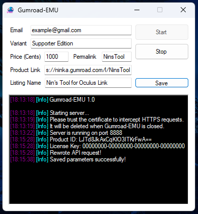

<h1 align="center">Gumroad-EMU</h1>

  

Gumroad-EMU is a license server emulator for Gumroad products, making it useful for "testing" and "development" purposes.

## Features 🌟

- Intercepts requests to Gumroad's API, always returning valid responses
- Doesn't require administrator privileges
- You can save your settings for later
- Uses FiddlerCore5

  

## Getting Started 🚀

1. Download the latest release from the [Releases](https://github.com/your-username/Gumroad-EMU/releases) page.
2. Run the application and trust the generated certificate when prompted.
3. Fill out all applicable information for the software you're trying to test.
4. Test the software as normal. Gumroad-EMU will rewrite API requests for you.
